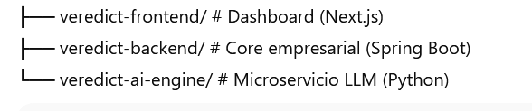

# ⚖️ Veredict BI — Inteligencia Neural de Decisión

**Veredict BI** es una plataforma soberana de **inteligencia de decisión para reclutamiento**, diseñada para automatizar la **preselección y el ranking de talento a escala global**.  
Mediante una arquitectura de **microservicios** y **orquestación avanzada de LLMs**, transforma currículos no estructurados en **activos de datos estratégicos**.

---

## 🚀 Diferenciales Clave

- **Neural Arena Re-Ranking**  
  Recalcula en tiempo real el *match* de toda la base de candidatos ante cualquier cambio en la vacante (JD).

- **Orquestación Multi-Modelo**  
  - *Llama-3.3-70B*: Ingestión profunda y extracción de ADN técnico.  
  - *Llama-3.1-8B*: Recalibración síncrona de alto rendimiento.

- **Arquitectura Hexagonal (Clean Architecture)**  
  Backend Java desacoplado, altamente mantenible y testeable.

- **Integridad UTF-8**  
  Preservación total de identidades y terminología técnica en PT/ES.

---

## 🛠️ Stack Tecnológico

**IA (Python)**  
- FastAPI · LangChain · Groq · Pydantic

**Backend (Java)**  
- Spring Boot 3.4 · Hibernate/JPA · PostgreSQL · Spring Security

**Frontend (Analytics)**  
- Next.js 15 · Tailwind CSS · Recharts (Radar Charts)

---

## 🏛️ Arquitectura

---

## 📈 Resultados Técnicos

- ⏱️ **-80% de latencia** mediante optimización de tokens y poda de contexto.  
- 🧠 **100% consistencia JSON** con Native Enforcement vía Groq.  
- 🔄 **Sincronización transaccional** en tiempo real durante el re-ranking.

---

## 🛡️ Gobernanza y Privacidad

Implementa **Node Identity**, asignando identidades únicas y anonimizadas a cada candidato antes del procesamiento en la nube.

---

**Autor:** [Tu Nombre]  
*Ingeniero de Software especializado en IA de Decisión y Sistemas de Alto Rendimiento*
